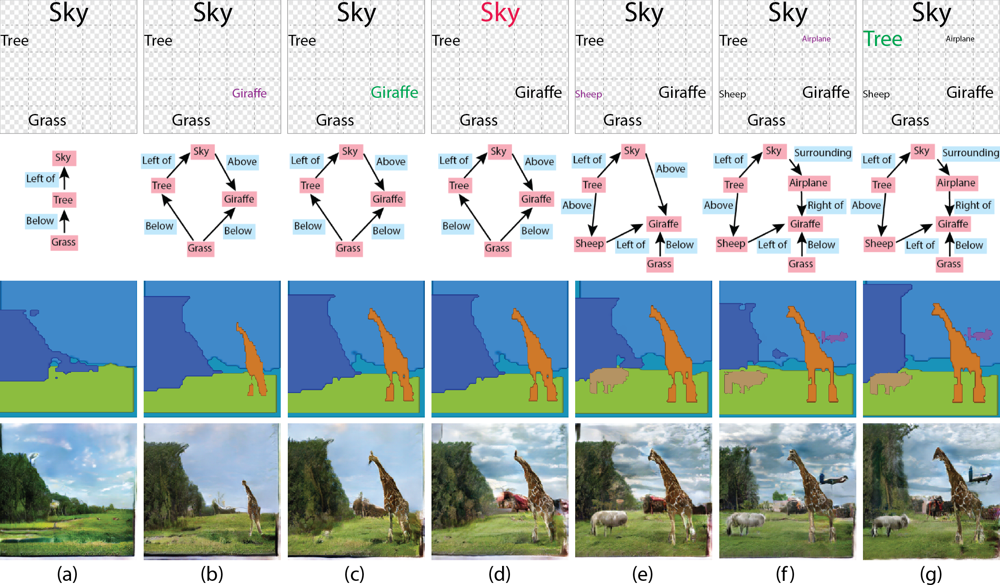
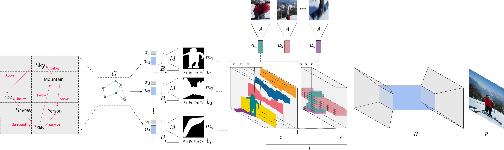

# Specifying Object Attributes and Relations in Interactive Scene Generation
A PyTorch implementation of the paper [Specifying Object Attributes and Relations in Interactive Scene Generation](https://arxiv.org/abs/1909.05379)
<p align="center"></p>

## Paper
[Specifying Object Attributes and Relations in Interactive Scene Generation](https://arxiv.org/abs/1909.05379)
<br/>
[Oron Ashual](https://www.linkedin.com/in/oronashual/)<sup>1</sup>, [Lior Wolf](https://www.cs.tau.ac.il/~wolf/)<sup>1,2</sup><br/>
<sup>1 </sup> Tel-Aviv University, <sup>2 </sup> Facebook AI Research <br/>
The IEEE International Conference on Computer Vision ([ICCV](http://iccv2019.thecvf.com/)), 2019, (<b>Oral</b>)

## Network Architechture
<p align='center'></p>

## Youtube
<div align="center">
  <a href="https://www.youtube.com/watch?v=V2v0qEPsjr0"></a>
</div>

## Usage

### 1. Create virtual environment (optional)
All code was developed and tested on Ubuntu 18.04 with Python 3.6 (Anaconda) and PyTorch 1.0.

```bash
conda create -n scene_generation python=3.7
conda activate scene_generation
```
### 2. Clone the repository
```bash
cd ~
git clone git@github.com:ashual/scene_generation.git
cd scene_generation
```

### 3. Install dependencies
```bash
conda install --file requirements.txt -c conda-forge -c pytorch
```
* install pytorch which will fit your CUDA TOOLKIT

### 4. Install COCO API
Note: we didn't trained our models with COCO panoptic dataset, the coco_panoptic.py code is for the sake of the community only.
```bash
cd ~
git clone https://github.com/cocodataset/cocoapi.git
cd cocoapi/PythonAPI/
python setup.py install
cd ~/scene_generation
```

### 5. Train
```bash
$ python train.py
```

### 6. Encode the Appearance attributes
```bash
python scripts/encode_features --checkpoint TRAINED_MODEL_CHECKPOINT
```

### 7. Sample Images
```bash
python scripts/sample_images.py --checkpoint TRAINED_MODEL_CHECKPOINT --sample_features 1 --batch_size 32 --output_dir OUTPUT_DIR 
```

### 8. or Download trained models
Download [these](https://drive.google.com/drive/folders/1_E56YskDXdmq06FRsIiPAedpBovYOO8X?usp=sharing) files into models/


### 7. Play with the GUI
The GUI was built as POC. Use it at your own risk:
```bash
python scripts/gui/simple-server.py --checkpoint YOUR_MODEL_CHECKPOINT --output_dir [DIR_NAME] --draw_scene_graphs 1
```

## Citation

If you find this code useful in your research then please cite
```
@InProceedings{Ashual_2019_ICCV,
    author = {Ashual, Oron and Wolf, Lior},
    title = {Specifying Object Attributes and Relations in Interactive Scene Generation},
    booktitle = {The IEEE International Conference on Computer Vision (ICCV)},
    month = {October},
    year = {2019}
}
```

## Acknowledgement 
Our project borrows some source files from [sg2im](https://github.com/google/sg2im). We thank the authors.